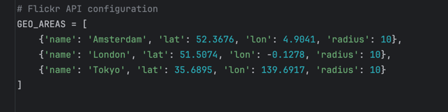
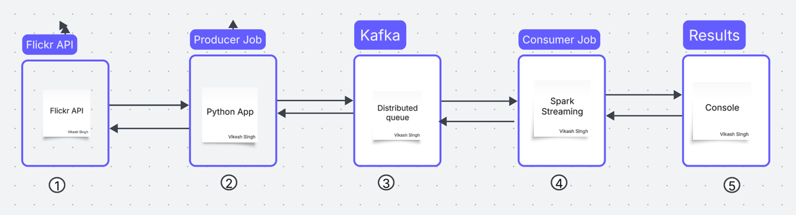

# sentiment_analysis demo

# sentiment_analysis/

 # Problem statement: 

Sentiment Analysis: How happy are people when looking at photos originating from a certain
geographic area currently? Big Brother Inc. wants to prevent an uprising by monitoring this in real
time. Develop an application that gives a real-time overview of the top N sentiments (or tags)
in different geographic areas

Solution Details:

The developed solution will take geo-location details to fetch the data from flick API for analysis. 
As of now i have mentioned in Producer config in below screen shot. This can be more dynamic based on need. 
We can be also used pretrained model to read the tags to get real sentiment. I can implement it as well but need more time for it.
Code has added check point to prevent duplicate data reading.

The Existing system is dockerised solution where we can deploy to any cloud as weel
1> Dockerised solution
2> Modular code
3> Added CI CD pipeline via github action
4> Scalable based on need ( kubernates)

Basic System design

Basic Data flow through system

1> The Flicker API source
2> Data Producer (Python application): This will be fetch data from Flicker Api and save to Kafka topics
3> Kafka system where we queue the Flicker data to further processing
4> Data Process by Spark streaming
5> The Data visualization

# Instruction to run Locally

1> Create virtual env and install requirements.txt
2> Create kafka topics (flickr-photos) ( kafka should be running local)
3> Run the run_producer.py to consume the data from flickr (You can use your own Flickr key)
4> Run the run_processor.py to process the data from kafka topics and see the results in console

# Instruction to run docker
docker-compose up --build

# Results from code

